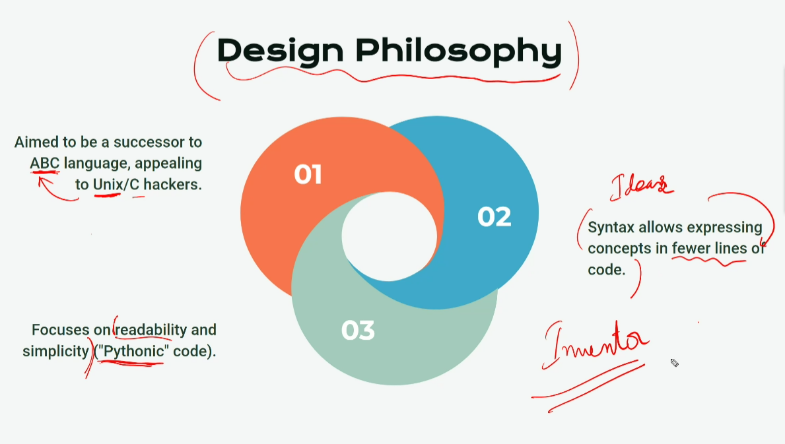
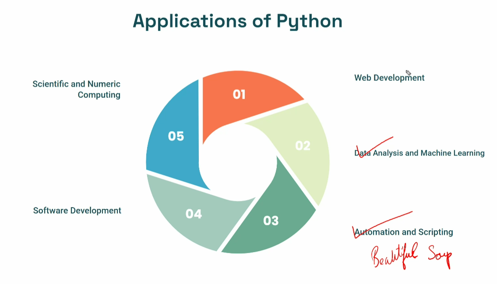
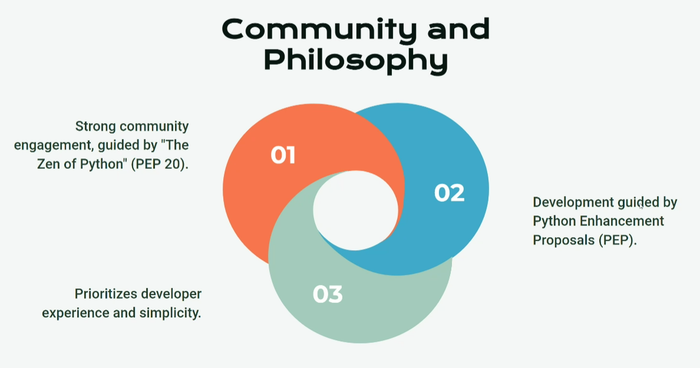

# Python - 03-05-2024(Day - 08)
## Introduction to Python:
 - High-level (Human Readable)
    - Simple Error Correction
    - Higher level of abstraction
 - Interpreted
 - General-purpose programming language
 - Guido Van  Rossum (creator) 
    - 1991
    - BDFL (Benevolent Dictator For Life) - Until 2020
 - Emphasizes code readability with significant indentation.

 ## Design  Philosophy:
    Do one thing and do it well - UNIX

 
 ## Major Milestones:
    - Python 2.0 (2000)
        - Introduced list comprehensions
        - Garbage Collection, to deallocate memory in RAM that is no longer required by the program.
    -  Python 3.0 (2008)
        - Disadv: Backward compatibility issues, many libraries are written for Python 2.x versions.


## Popularity and Use  Cases:


## Applications:


## Community & Philosophy:


## Coding:
>[Replit -> ](https://replit.com/)
    >Real - Eval - Print - Loop

## 5 Pillars of Code Quality
1. Readability - 75%
2. Maintainability
3. Extendability
4. Testability
5. Performance

> Never sacrifice readability for performance!

# Setup
## Virtual ENV
```bash
python -m venv myenv
```
## Activate
```sh
.\myenv\Scripts\Activate.ps1
```
### Git Ignore 
Add `.gitignore` 
```gitignore
 myenv
```
rm -rf myenv


